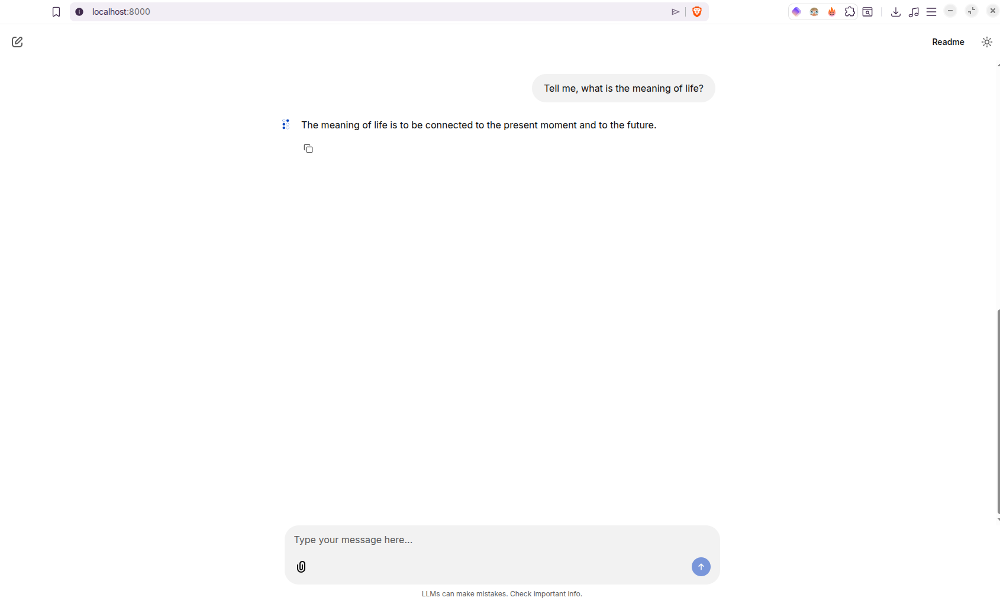

# ShefQET - GPT-2 model from scratch



A GPT-2 model built from scratch in PyTorch and fine-tuned on instruction-following data.

## Project Structure
```
src/
├── BPE_tokenizer.py     # Byte-pair encoding dataloader
├── attention_layer.py   # Multi-head self-attention implementation
├── model.py             # GPT architecture
├── train.py             # Training loop and loss functions
└──  weights.py          # Download and load pretrained GPT-2 weights from OpenAI

data/
├── instruction-data.json  # Fine-tuning dataset (instruction/input/output)
└── the-verdict.txt        # Openly available short story used for initial pretraining experiments

finetune.py   # Fine-tunes GPT-2 medium (or small) on instruction data, saves model weights
main.py       # Load the fine-tuned model and chat with it (streaming token-by-token output)
```

## Usage
The model needs to be finetuned first. This will download the GPT-2 355M pretrained weights from OpenAI (around 1.5GB) and run training on the instruction dataset. Technically this is possible with the small 124M model, but practically the chatbot's responses would be grammatically correct but incoherent. Responses are streamed token by token as they are generated, similar to how ChatGPT displays output. 

```bash
python3 finetune.py
```  

After the training is completed, the weights are saved to `models/gpt2-medium355M-sft.pth`. You can then chat with the model: 

```bash
python3 main.py
```

## Requirements

```bash
pip install torch tiktoken tensorflow requests tqdm
```

## Acknowledgements
Based on the book [Build a Large Language Model From Scratch](https://www.manning.com/books/build-a-large-language-model-from-scratch) by Sebastian Raschka.
